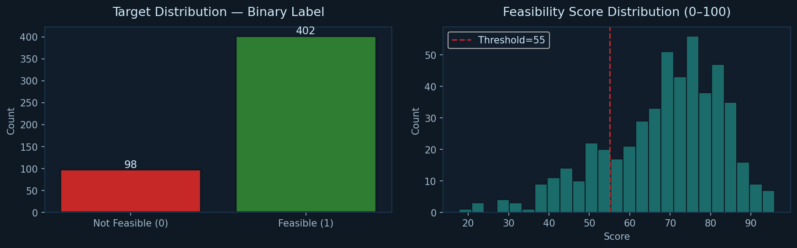
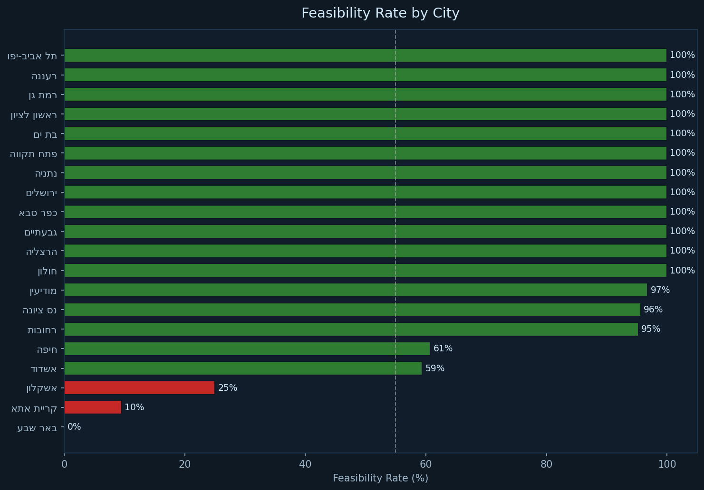
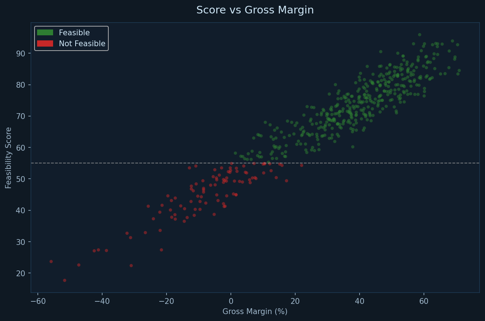

# 🏗️ Urban Renewal Feasibility Scoring Tool
### כלי ML לבדיקת כדאיות עסקאות התחדשות עירונית בישראל


---

## 🚀 הפעלה — מחשבון בדפדפן

**מחשבון חי:** [https://shaked28.github.io/urban-renewal-ml/calculator.html](https://shaked28.github.io/urban-renewal-ml/calculator.html)

המחשבון רץ ישירות בדפדפן, ללא שרת וללא התקנה. מבוסס על נוסחת הניקוד המקורית
של ה-dataset (`score = 38 + 0.6×margin% + 0.15×approval%`).

> כדי שהקישור יעבוד יש להפעיל GitHub Pages (פעם אחת):
> Settings → Pages → Source: `Deploy from a branch` → Branch: `main` / `/docs` → Save.
>
> כחלופה: הורד את [`calculator.html`](calculator.html) ופתח ישירות בדפדפן — עובד גם offline.

---

## תיאור הפרויקט

כלי מבוסס למידת מכונה המאפשר לשמאים, יזמים ומשקיעים לבחון את הכדאיות הכלכלית של עסקאות התחדשות עירונית (תמ״א 38/1, תמ״א 38/2, פינוי-בינוי) בישראל. הכלי מחזיר **ציון כדאיות (0–100)**, סיווג בינארי, הסברי SHAP לכל גורם, וניתוח רגישות לתרחישים.

---

## Quick Start

```bash
# Install
pip install -r requirements.txt

# Train models (required before app)
python models/train.py

# Run EDA & generate figures
python notebooks/eda_and_eval.py

# Run tests
python -m pytest tests/ -v

# Launch app
streamlit run app/main.py
```

---

## Model Performance (Real Results)

### Classification — כדאי / לא כדאי

| Model | AUC-ROC | Accuracy | CV-AUC | Notes |
|-------|---------|----------|--------|-------|
| **Logistic Regression** | **0.9913** | **0.9400** | **0.9889** | **Best — auto-selected** |
| Random Forest | 0.9863 | 0.9500 | 0.9904 | |
| XGBoost | 0.9881 | 0.9600 | 0.9837 | |
| Gradient Boosting | 0.9612 | 0.9700 | 0.9627 | |

### Regression — ציון כדאיות (0–100)

| Model | RMSE | R² | Notes |
|-------|------|----|-------|
| **Ridge** | **4.250** | **0.918** | **Best — auto-selected** |
| Random Forest Reg | 4.614 | 0.903 | |
| Gradient Boosting Reg | 4.705 | 0.899 | |
| XGBoost Reg | 4.757 | 0.897 | |

> מדדים אמיתיים שנמדדו על test set (20%, stratified). אימון על Python 3.12 / scikit-learn 1.3+.

---

## Screenshots — EDA Figures

### Target Distribution


### Feasibility by City


### Score vs Gross Margin


---

## ארכיטקטורה

```
Input Parameters → Feature Engineering → ML Pipeline → Score + SHAP
     ↓                    ↓                   ↓              ↓
  City, Type          6 derived          LR / RF /       0-100 score
  Building age        features           XGB / GBM       Binary label
  Prices, cost_sqm    (ratio, cost,      Best auto-      SHAP explain.
  Timelines           leverage...)       selected        Sensitivity
```

### Feature Engineering (6 נוספים)

| שם עמודה | נוסחה |
|----------|-------|
| יחס_דירות_חדש_לישן | new_units / existing_units |
| הכנסה_לדירה_קיימת | revenue / existing_units |
| עלות_לדירה_חדשה | total_cost / new_units |
| שטח_כולל_חדש_מ2 | new_units × new_sqm |
| מינוף_שטח | new_area / old_area |
| עלות_לקיים_יחסי | construction_cost / revenue |

### פיצ'רים חדשים (input ישיר)

| שם עמודה | תיאור |
|----------|-------|
| עלות_למ2_בנייה_ש"ח | עלות בנייה למ"ר — בסיס לחישוב עלות הבנייה |
| חודשי_החתמה | חודשי החתמת הדיירים — חלק ממשך הפרויקט |

---

## Project Structure

```
urban_renewal_project/
├── data/
│   ├── urban_renewal_dataset.xlsx   ← 500 עסקאות, 33 עמודות
│   └── regenerate_dataset.py        ← סקריפט עדכון דאטאסט
├── models/
│   ├── train.py                     ← Pipeline אימון מלא
│   ├── best_classifier.pkl          ← Logistic Regression (AUC=0.9913)
│   ├── best_regressor.pkl           ← Ridge Regression (RMSE=4.250)
│   ├── shap_explainer.pkl
│   └── model_meta.json              ← מטא + ביצועים
├── app/
│   └── main.py                      ← Streamlit UI (Hebrew RTL)
├── notebooks/
│   └── eda_and_eval.py              ← EDA + 5 charts
├── docs/
│   ├── figures/                     ← 5 PNG charts
│   ├── index.html                   ← GitHub Pages landing page
│   ├── mvp_report.docx
│   └── final_report.docx
├── presentation/
│   └── final_presentation.pptx     ← 8-slide deck
├── tests/
│   └── test_pipeline.py             ← 6/6 pytest passing
└── requirements.txt
```

---

## Academic Context

פרויקט גמר — קורס "פרויקט מעשי בלמידת מכונה"
הקריה האקדמית אונו | סמסטר קיץ תשפ״ה
**שקד עקריש** | מנחה: ד״ר איל זינגר

---

## License

MIT

---

## Hosting — GitHub Pages

הקובץ [`calculator.html`](calculator.html) הוא מחשבון JavaScript עצמאי שעובד בדפדפן ללא שרת.
לפרסום ציבורי דרך GitHub Pages:

1. בעמוד הרפו ב-GitHub: **Settings** → **Pages**
2. תחת **Source** בחר: `Deploy from a branch`
3. **Branch**: `main` · **Folder**: `/docs`
4. **Save** → לאחר ~דקה האתר יהיה זמין ב:
   `https://shaked28.github.io/urban-renewal-ml/`
   והמחשבון: `https://shaked28.github.io/urban-renewal-ml/calculator.html`

לחלופין — אפשר לפתוח את `calculator.html` ישירות בדפדפן מקומי (גם offline).

המודלים המאומנים (`*.pkl`) ו-Streamlit (`app/main.py`) זמינים לפיתוח מקומי
לחוקרים שרוצים את ה-pipeline המלא של ה-ML עם SHAP. ראה [`DEPLOY.md`](DEPLOY.md).
